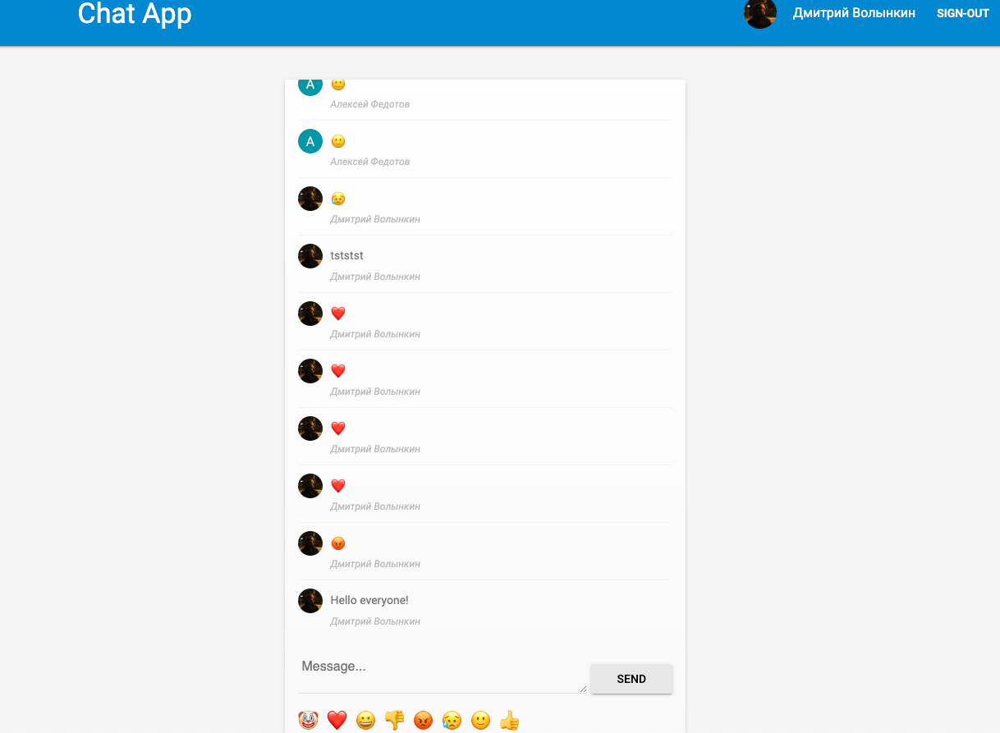
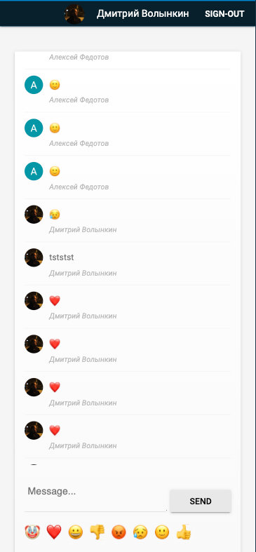

<div align="center">
  <h1><code>Chat app</code></h1>

  <p>
  <a href=""></a>
    
  </p>

_**[Deployed here](https://dmitrygvl.github.io/chat-app/)**_

## </div>

## Table of Contents

- [About](#about)
  - [Built with](#built-with)
  - [Rules](#rules)
- [Getting Started](#getting-started)
  - [Prerequisites](#prerequisites)
  - [Installing](#installing)
- [License](#license)

## About <a name="about"></a>

- You can exchange messages online.

- You can use emoji.

- Before sending a message, log in using your Google account.

<div align="center">
  
  
</div>

### Built with <a name="built-with"></a>

<p align="center"><a href="https://babeljs.io/" target="_blank">
   </a> <a href="https://www.w3schools.com/css/" target="_blank"> 
   </a> <a href="https://git-scm.com/" target="_blank"> 
   </a> <a href="https://www.typescriptlang.org/" target="_blank"> 
   </a> <a href="https://jestjs.io" target="_blank"> 
   </a> <a href="https://eslint.org/" target="_blank"> 
   </a><a href="https://webpack.js.org/" target="_blank"> 
   </a>
  <a href="https://redux.js.org" target="_blank"> 
   </a>
  <a href="https://firebase.google.com/" target="_blank"> 
   </a>
</p>

## Getting started <a name="getting-started"></a>

### Prerequisites <a name="prerequisites"></a>

:warning: Before installing the project latest version of **npm** should be installed.

```
npm install -g npm@latest
```

### Installing <a name="installing"></a>

1. Clone the repo

```
git clone https://github.com/dmitrygvl/chat-app.git
```

2. Install NPM packages

```
npm install
```

3. Start the project

```
npm run start
```

## License <a name="license"></a>

[![MIT License][license-shield]][license-url]

[license-url]: https://github.com/othneildrew/Best-README-Template/blob/master/LICENSE.txt
[license-shield]: https://img.shields.io/github/license/othneildrew/Best-README-Template.svg?style=for-the-badge
